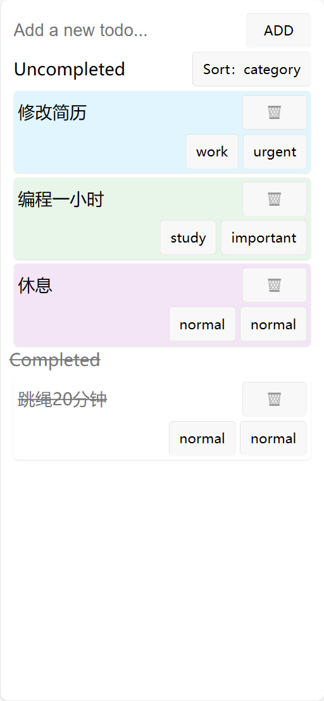
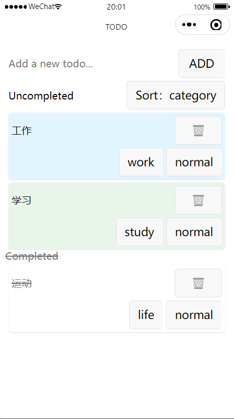
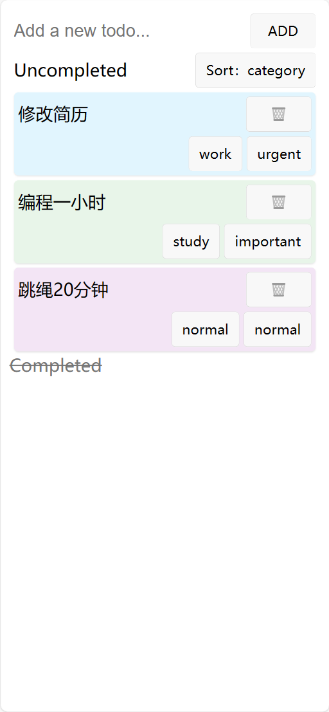

# 项目介绍

## 项目名称

- TODOList

## 项目简介

- 一个简单的 TODOList
- 功能
- 添加 TODO
- 完成 TODO
- 删除 TODO
- 修改 TODO 类型
- 修改 TODO 优先级
- 按照类型、优先级、时间排序

## 项目运行

- 安装依赖
  `npm install`
- 运行
  `npm run dev:h5`
  `npm run dev:weapp`

## 项目截图

- 
- 
- 
